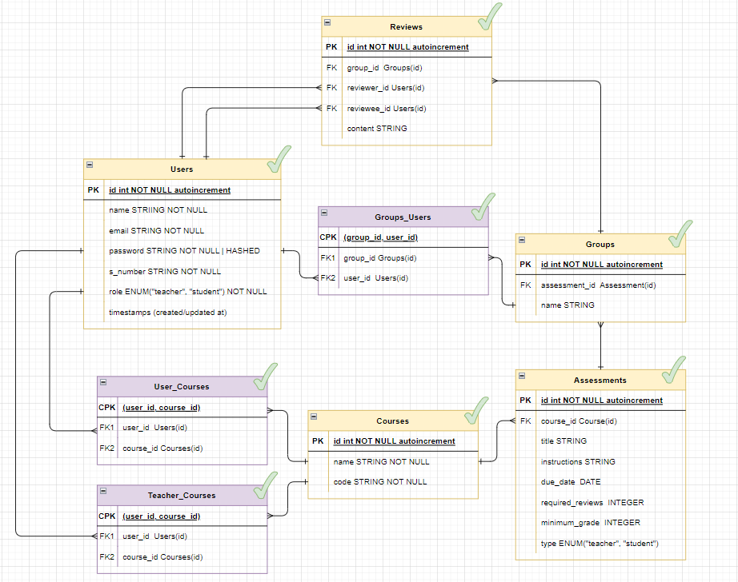
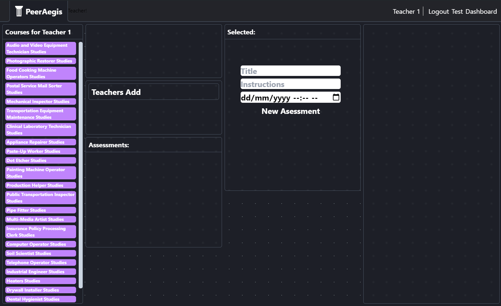

= PeerAegis
:hide-uri-scheme:

> A university peer review app.

== Requirements

* Must Use Laravels:
- Migrations
- Seeders
- Models
- ORM/Eloquent
- Route
- Controllers
- Validator
- View
- Templating

* 1. Two Types of Users
- Teachers & Students
- Students must register
- Teachers are seeded into database

* 2. All users must login to access functionality of the site
- Users login with S number (s_xxxxx)
- Name and Type displayed in navbar

* 3. Users can logout

* 4. Home Page
- Lists all courses users is enrolled or teaching.
- Students can enroll in multiple courses
- Teachers can teach multiple courses

* 5.

== Description
=== Dependencies
==== Frontend
* Laravel: https://laravel.com
 - "PHP web application framework"
* Livewire: https://livewire.laravel.com
 - "Powerful, dynamic, front-end UIs without leaving PHP."
* TailwindCSS: https://tailwindcss.com
 - Styling

==== Useful Reviews Backend
* Ollama: https://ollama.com
 - For running models locally with an accessible API
* Llama 3.1: https://llama.com
 - The model actually being used
* LangChain & LangGraph: https://langchain.com
 - To compose the model and tools
* Arize Phoenix: https://github.com/Arize-ai/phoenix
 - Trace routes & Debugging

== Planning

- Meta:
- Constructed simple ai langchain setup
- prototyped different front end styles
- tried different 'starter templates', found them confusing and wasnt sure if i could use them
- couldnt get good a good dynamic ui, figured out 'livewire', figured it was built into laravel so i could use it if i was still fulfilling all the other requirements
- tried using inertia, found it to use way too much boilerplate code, and even more files to go through

== Entity Relationship Diagram

- Yellow: Core Tables
- Purple: Associative? Tables

=== Difference between Teacher Assigned vs Student Assigned "Assessments"
==== Teacher Assigned
* Allows for a teacher to specify how many reviews are required per student
* Before submission, the form 'shuffles' all the students into 'groups' of n+1 where n is the required amount of reviews
* +1 due to including themselves. eg: 2 Required Reviews (Alice -> Reviews (Bob, Charlie) ) = Group of 3

==== Student Assigned
* Creates a 'group' of all the students
* Students then can select the assessment and see all of their peers they can review (filtering out students the user has already review)
* And can view all of their received reviews

== Useful Reviews

- uses AI to score
- reviewees also mark
- Scoreboard    [ User | Avg | AI Score ]
 * User is the user,
 * Avg is the average rating from all the 'usefulness' scores from the reviewee
 * AI score is the average usefulness score the ai has given for each review

=== Expansion
There is great potential to expand the AI component of this. Some quick ideas.

- Use reviewees score to finetune model into scoring usefulness better
- Rate 'safety' for reviews, if reviews are 'rude' or inappropriate, flag for teacher review
- "Personal coach"
  * take the review with the context of the actual 'work' and explain how the review could be used to further improve their work (may only work with textual documents currently, may cost money, could be a subscription)
 * better summary of the peer review
- Parse all user reviews, see if any students have done particullarly 'good' based on reviews throughout the trimester, or may need some encourement/help
 * "from past peer reviews it appears like you may be struggling, if you require extra help here are some locations to find it X Y Z"

WARNING: Wolpertingers are known to nest in server racks.
Enter at your own risk.

[WARNING]
.Feeding the Werewolves
====
While werewolves are hardy community members, keep in mind the following dietary concerns:

. They are allergic to cinnamon.
. More than two glasses of orange juice in 24 hours makes them howl in harmony with alarms and sirens.
. Celery makes them sad.
====
